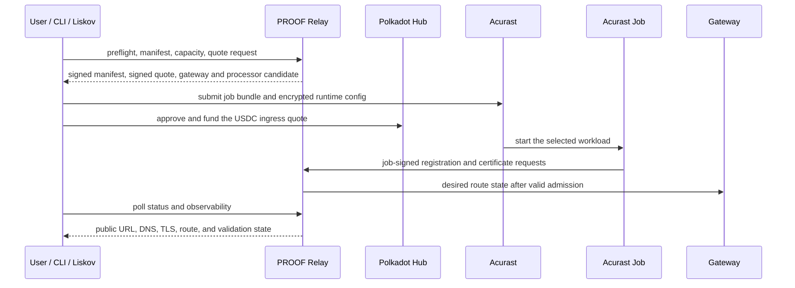
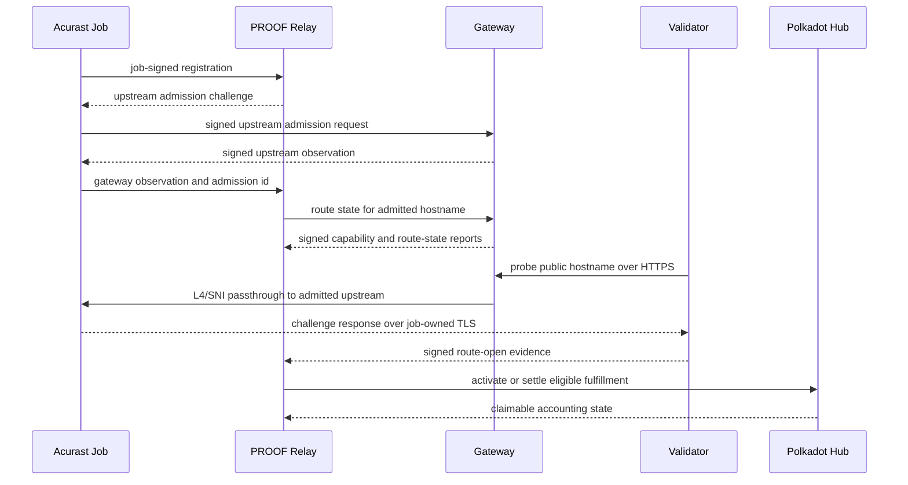
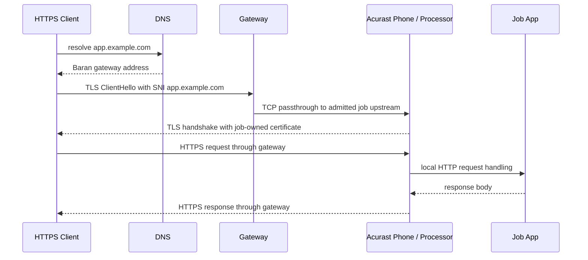

# Ingress Session Flow

An ingress session joins local signing, Acurast compute, Hub payment,
Baran relays, gateway route state, job-owned TLS, and validator
evidence. These diagrams show the same session from three angles.

## User And CLI Flow

This is the path a developer sees through the CLI. Liskov or another trusted
caller can replace the interactive user shell when it preserves the same
signing, funding, and confirmation boundaries.

What this shows: the caller funds the session and submits compute, but the job
still signs its own registration and certificate requests.

## Baran Coordination Flow

This is the control-plane path after a job starts. The relay coordinates state,
the gateway proves the upstream it observed, and validators gate activation and
settlement with public route evidence.

What this shows: route targets come from signed gateway upstream admission, not
from arbitrary job health metadata. Validation proves the public route before
settlement.

## HTTPS Traffic Path

This is the data path for a normal user request. The gateway routes by SNI and
passes bytes through; the Acurast job owns the certificate and terminates TLS.

What this shows: the gateway does not hold the application private key and
does not terminate application TLS in the default Baran path.
