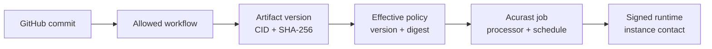

# Artifacts, encryption, and provenance

Liskov deploys an immutable artifact version, not a mutable branch or URL. For
the v1 repository path, that version is an IPFS bundle identified by both a
content identifier (CID) and a SHA-256 digest.

## Evidence chain

| Evidence | What it supports | What it does not prove |
| --- | --- | --- |
| GitHub OIDC | The repository, ref, commit, and workflow identity seen by GitHub. | That the source is safe or correctly reviewed. |
| CID and digest | The exact uploaded bundle bytes. | Who authored those bytes. |
| Artifact version | Liskov's stable record joining bytes and accepted provenance. | That a policy selected it. |
| Policy digest/version | The immutable execution contract for one Application. | That the network accepted or started a job. |
| Job and processor evidence | Registration, schedule, assignment, and network identities. | That application code became ready. |
| Signed runtime contact | A bound runtime instance contacted Liskov and reported capability state. | That every application-level request is correct. |

Together these facts make claims reviewable without pretending that one
attestation proves the whole system.

## Encryption modes

An IPFS artifact declares `none` or `aes256_gcm`. A build release normally
requests `aes256_gcm`; the released artifact record binds the resulting bytes
and encryption facts. A curated Marketplace descriptor may deliberately pin
an unencrypted public bundle. Encryption does not make untrusted source safe,
and an unencrypted artifact does not weaken processor TEE isolation by itself.

Do not put secrets in the bundle in either mode. Managed secrets are separate,
versioned configuration delivered for a particular job.

## Marketplace provenance

A Marketplace launch selects an exact offering version and its pinned artifact
evidence. Review the source repository, version, CID, and digest displayed by
the listing. Marketplace curation is a product decision; it is not a general
third-party publishing or payout system in v1.

## Repository provenance

The manifest authorizes a narrow builder identity. A build from another repo,
ref, workflow, or manifest path must fail even if its bundle has the same
filename. When publishing, select the exact artifact-version ID produced by
the run you reviewed.

Continue with [Inspect the proof chain](../operate/proof-chain.md) to verify a
running deployment.
