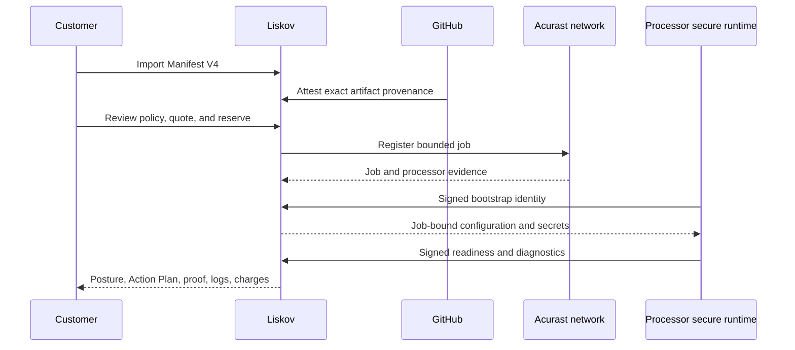

# How Liskov works

Liskov is a control plane for long-running intent over time-boxed Acurast jobs.
You build immutable code, declare its authority, use an eligible organization's
existing Service Credit allocation, and inspect evidence as Acurast phones
execute it in trusted hardware.

## End-to-end sequence

The GitHub path starts from a V4 manifest and an allowed workflow that builds,
pins, and attests an artifact before it converges on an immutable effective
policy. Marketplace is intended to start from a curated pinned artifact and
option schema, but customer launch remains release-gated and is not part of
this sequence yet.

## Desired state and observed state

The policy says what Liskov is authorized to seek: artifact, runtime,
configuration, schedule, placement, lifecycle, and spend bounds. The network
then produces observed facts: quote, reserve, registration, processor
assignment, runtime contact, actual overlap or gap, and final charge.

Liskov does not rewrite observed history to match intent. If a successor is
late, the timeline records a gap. If a registered predecessor continues during
an update, the timeline records overlap.

## What the customer controls

You control organization access, release choice, authored authority, managed
configuration, external accounts, confirmation of spend-bearing work, and
lifecycle requests. Liskov manages network payment and replacement planning
within those bounds. Acurast owns chain registration and processor assignment.
The processor runs the job. Your external services remain their own trust and
cost boundaries.

Start with [Applications, policies, artifacts, deployments, and jobs](./domain-model.md),
then read [Trust and data boundaries](./trust-boundaries.md).
