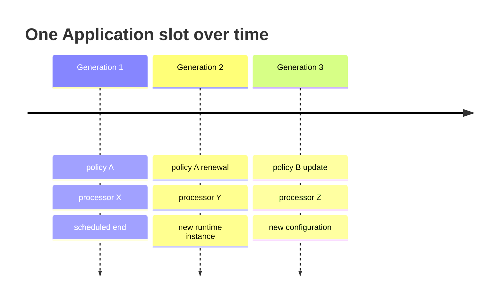

# Replacement custody and time-boxed execution

Liskov provides **replacement custody**: it safely holds the authority and
state needed to create bounded successor jobs as an Application renews,
updates, or recovers from a launch-stage failure.

It does not own a kill switch for the Acurast network.

## Why successors exist

An Acurast job has an immutable registration and scheduled end. The long-lived
Application therefore continues through generations:

Liskov records desired successor state separately from proof that it was
submitted, assigned, bootstrapped, and ready.

## Renewal and update

Renewal uses the same effective policy digest. An update selects a new policy,
artifact, or configuration generation. Fixed pre-end renewal can request
overlap; after-end renewal can avoid deliberate overlap. Neither guarantees
continuity because processor assignment and startup are market/network facts.

The supported v1 update behavior lets existing jobs run to scheduled end. That
preserves chain truth and can produce two live generations temporarily. Design
workloads with idempotent operations, leases, or external coordination when
duplicate activity matters.

## Pause and retirement

Pause stops new Liskov planning and spend admission. Existing registrations
continue. Retirement starts with pause, waits for all schedules and financial
tails to close, and then seals a receipt. No user or administrator can turn an
ambiguous nonzero gate into “complete.”

## Failure budgets

Launch retries are bounded by policy and surfaced through the Action Plan.
Runtime replace-after-failure is not enabled in the first public capability
set; v1 waits for scheduled end. This avoids hiding repeated spend or creating
unbounded replacement loops.

The core distinction is simple: policy describes allowed intent; evidence
describes what actually happened.
