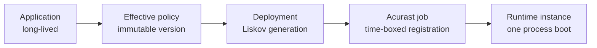

# Deployments, jobs, and timelines

These resources have different lifetimes:



- An **Application** owns desired configuration and history.
- An **effective policy** is one immutable, normalized execution contract.
- A **deployment** is Liskov's recorded attempt or generation to realize it.
- A **job** is the Acurast network registration with a schedule and processor.
- A **runtime instance** is one process boot within that job.

A renewal or update creates successors; it does not mutate a registered job.
A process restart within one job creates a new runtime-instance identity rather
than pretending it is continuous with the previous boot.

## Read the timeline

Use the Application workspace or:

```bash
proof liskov application deployment status APPLICATION_ID --json
proof liskov application activity APPLICATION_ID --limit 50 --json
```

Follow identifiers as the flow advances:

1. effective policy version and digest;
2. deployment ID, slot, and generation;
3. submission or registration evidence;
4. Acurast job ID and scheduled bounds;
5. processor assignment;
6. signed bootstrap and runtime-instance ID; and
7. readiness, health, terminal, and settlement evidence.

Processor assignment is not runtime readiness. A registered job can still be
waiting to boot, fetch configuration, obtain required secret grants, or report
health.

## Successors and overlaps

For the first public capability, one logical slot has monotonic generations.
An update or renewal can create a successor while a predecessor remains
chain-owned until scheduled end. The timeline is authoritative about actual
overlap or gaps. “Desired replacement” is not proof that a successor was
submitted, assigned, or ready.

## Verify

When investigating, name the exact deployment and job rather than saying “the Application failed.” Compare scheduled end with the latest runtime evidence and Action
Plan decision. This prevents a healthy predecessor from being confused with a
blocked successor.

See [Replacement custody and time-boxed execution](../concepts/replacement-custody.md)
for why Liskov uses this model.
