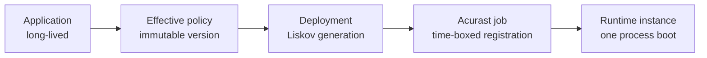

# Deployments, jobs, and timelines

These resources have different lifetimes:



- An **Application** owns desired configuration and history.
- An **effective policy** is one immutable, normalized execution contract.
- A **deployment** is Liskov's recorded attempt or generation to realize it.
- A **job** is the Acurast network registration with a schedule and processor.
- A **runtime instance** is one process boot within that job.

A renewal or update creates successors; it does not mutate a registered job.
A process restart within one job creates a new runtime-instance identity rather
than pretending it is continuous with the previous boot.

## Read the timeline

Use the Application workspace or:

```bash
proof liskov application deployment status APPLICATION_ID --json
proof liskov application activity APPLICATION_ID --limit 50 --json
```

Follow identifiers as the flow advances:

1. effective policy version and digest;
2. deployment ID, slot, and generation;
3. submission or registration evidence;
4. Acurast job ID and scheduled bounds;
5. processor assignment;
6. signed bootstrap and runtime-instance ID; and
7. readiness, health, terminal, and settlement evidence.

Processor assignment is not runtime readiness. A registered job can still be
waiting to boot, fetch configuration, obtain required secret grants, or report
health.

After a job's strict reporting window closes, the timeline may say **Not billed
— no report filed**. For managed custody this means the finalized scanner proved
report absence, the charge is zero, the full reserve is released, and there is
no review amount or customer action. It does not say whether customer code ran
for any particular duration. Stronger signed-fatal or disagreement evidence
keeps its own treatment, and an open or unreadable report window remains
pending.

When the Console names a processor, select its identifier to open the
organization-level [processor record](./processors.md). That record brings
together your organization's deployment history on the processor, the chain's
published hardware facts, and any Enterprise register intelligence. It is not
a processor directory, and opening it does not change the deployment.

## Order the Deployments page

Open **Deployments** in the Application workspace. **Order → Stable job** groups
recorded executions by their stable job, newest generation first. **Time** orders
the same rows by their recorded window start, newest first. Changing the order
does not request a deployment, change a schedule, or change the recorded costs.

The selected order is shareable in the URL: `?order=stable` or `?order=time`.
An older `?order=job` link still selects Stable job, as does an absent or invalid
order. Switching preserves other query values and a row fragment such as
`#slot-1:g3`. Back, Forward, and reload restore the selected presentation.

Use Tab to reach the selected choice, arrow keys to switch, or select a choice
directly. The control remains available while the page is empty or cannot read
execution evidence. Existing loaded history remains available when changing
order; use **Load more** for another bounded page.

## Read the summary line

The line marked **Now** states one verdict for the application, read from its
intent before its state: a retired application reads **Stopped**, an interval
application between runs reads **Between runs** with its next due time, and a
finished one-shot reads **Done**. Beside the verdict it counts how many loaded
deployments are on chain and stamps the clock the page was read at. During an
authored replace-now it adds **Replacing now · N of M jobs moved**; each job's
header then carries **on the new schedule** or **not yet · joins HH:MM:SS**.

In Stable job order each job's header names its phase and served target, the
registered window length, and how many generations are shown, loaded, and
reported in total. The footer beneath the table repeats the application's
shape, then scopes its counts to **loaded history**: Acurast deployments,
tries, and the oldest loaded window start.

## Read a row

Each row names its generation (`g4`, or `slot-1 · g4` in Time order) with its
place in the job beneath: **current**, **predecessor**, **successor**,
**planned successor**, **generation**, **first generation**, **only
generation**, **last run**, **next run**, or during a replace-now
**re-phased**, **replaced**, **new schedule**, and **previous schedule**. These
relate the loaded rows to each other; they are not a schedule prediction.

**Where and when** leads with the processor and follows with the registered
window's exact start and end. A missing processor says why: **no processor
claimed** for a registered job nothing has claimed, **processor not reported**
when contact was recorded but the read carried no identifier, **the register
did not answer** when evidence is unreadable, and **nowhere yet** for a plan.
A plan whose paid window is not yet registered shows **due HH:MM:SS** instead
of a window, and that due boundary places it in Time order.

## Read states and Service Credits

A **Scheduled** row is a plan. It is drawn hatched and has no execution link,
Acurast number, processor, or charge; its credits read **Not priced** until
there is recorded execution evidence. A planned start may be absent before an
anchor is known. **Submitted** means execution is authorized or in flight;
check the Acurast number and registration evidence to see whether it reached
the chain. **Ready** means runtime contact was recorded before the window,
and **Serving** means the contacted deployment is within its window.

**Held** means a processor claimed the job and the expected runtime evidence
has not arrived; the row says **no runtime contact**. Attention groups show the
recorded blocker code, its family and decision, the affected jobs, and which
jobs Liskov is still retrying. Refused offers are counted from loaded history.
An **Action Plan** link appears when Liskov has recorded that it stopped
retrying; a shared blocker code does not prove a shared cause.
**Evidence unavailable** means the read cannot establish the state.

An **Ended** window can still have settlement pending. **Released** requires
recorded deregistration evidence. Read the amounts separately: **reserved**
credits remain committed, **charged** credits have settled, **in review**
credits await resolution, and **released** credits are available again.
A recorded zero charge is shown as zero; missing settlement is not a zero
charge. Small charges retain their precision, such as `$0.0008`.

## Expand history

**Show loaded history** expands rows already read. **Load more** requests the
next bounded page. Counts distinguish rows shown, generations loaded, and the
job's reported total. A planned successor does not add a physical generation.
In Time order, a plan sits at its due boundary, and records with neither a
known window nor a due boundary follow the known ones under **Window not
recorded**.

Refreshing preserves expanded history. If older records could not be refreshed,
the page marks that history as stale and retains it for inspection. Use
**Load more** to refresh the older records. Missing or unreadable history is
never proof that a deployment did not exist.

## When a job identity is not reported

Some retained execution records do not identify their stable job. Coverage
keeps their recorded status, Acurast number, window, and processor evidence in
**Job identity not reported** instead of placing them under another job.
Unknown identity does not mean that no deployment exists or that it failed.

A processor named by a deployment is different from a processor that made
verified runtime contact. Read the evidence label beside the identifier. Use
an execution link only when a recorded job coordinate is available; otherwise
use the recorded Acurast number and [diagnostic evidence](./diagnose-retry.md).

## Successors and overlaps

Each logical slot has its own sequence of generations.
An update or renewal can create a successor while a predecessor remains
chain-owned until scheduled end. The timeline is authoritative about actual
overlap or gaps. “Desired replacement” is not proof that a successor was
submitted, assigned, or ready.

## Verify

When investigating, name the exact deployment and job rather than saying “the Application failed.” Compare scheduled end with the latest runtime evidence and Action
Plan decision. This prevents a healthy predecessor from being confused with a
blocked successor.

See [Replacement custody and time-boxed execution](../concepts/replacement-custody.md)
for why Liskov uses this model.
