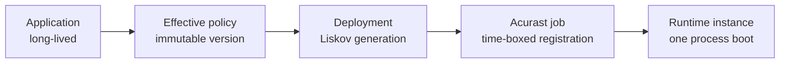

# Deployments, jobs, and timelines

These resources have different lifetimes:


```mermaid
flowchart LR
  A[Application<br/>long-lived] --> P[Effective policy<br/>immutable version]
  P --> D[Deployment<br/>Liskov generation]
  D --> J[Acurast job<br/>time-boxed registration]
  J --> R[Runtime instance<br/>one process boot]
```

- An **Application** owns desired configuration and history.
- An **effective policy** is one immutable, normalized execution contract.
- A **deployment** is Liskov's recorded attempt or generation to realize it.
- A **job** is the Acurast network registration with a schedule and processor.
- A **runtime instance** is one process boot within that job.

A renewal or update creates successors; it does not mutate a registered job.
A process restart within one job creates a new runtime-instance identity rather
than pretending it is continuous with the previous boot.

## Read the timeline

Use the Application workspace or:

```bash
proof liskov application deployment status APPLICATION_ID --json
proof liskov application activity APPLICATION_ID --limit 50 --json
```

Follow identifiers as the flow advances:

1. effective policy version and digest;
2. deployment ID, slot, and generation;
3. submission or registration evidence;
4. Acurast job ID and scheduled bounds;
5. processor assignment;
6. signed bootstrap and runtime-instance ID; and
7. readiness, health, terminal, and settlement evidence.

Processor assignment is not runtime readiness. A registered job can still be
waiting to boot, fetch configuration, obtain required secret grants, or report
health.

After a job's strict reporting window closes, the timeline may say **Not billed
— no report filed**. For managed custody this means the finalized scanner proved
report absence, the charge is zero, the full reserve is released, and there is
no review amount or customer action. It does not say whether customer code ran
for any particular duration. Stronger signed-fatal or disagreement evidence
keeps its own treatment, and an open or unreadable report window remains
pending.

When the Console names a processor, select its identifier to open the
organization-level [processor record](./processors.md). That record brings
together your organization's deployment history on the processor, the chain's
published hardware facts, and any Enterprise register intelligence. It is not
a processor directory, and opening it does not change the deployment.

## Order the Deployments page

Open **Deployments** in the Application workspace. The page has one
**Deployments** heading and one toolbar: search, status filters, and the
**Order** switch at the right. The page does not open with a **Now** summary.

**Stable job** groups recorded executions by their stable job, newest
generation first. Each job's header carries its word, including when the
application has one job. **Time** orders the same rows by their recorded
window start, newest first, and draws a divider at the present moment. The
switch has no extra label. Stable job's tooltip is **Grouped by the job
each deployment serves.** Time's tooltip is **Every deployment in one order
by window start.** Changing the order does not
request a deployment, change a schedule, or change the recorded costs.

The selected order is shareable in the URL: `?order=stable` or `?order=time`.
An older `?order=job` link still selects Stable job, as does an absent or invalid
order. Switching preserves other query values and a row fragment such as
`#slot-1:g3`. Back, Forward, and reload restore the selected presentation.

Use Tab to reach the selected choice, arrow keys to switch, or select a choice
directly. The control remains available while the page is empty or cannot read
execution evidence. Existing loaded history remains available when changing
order; use **Load more** for another bounded page.

Search asks the server and covers all history, not only the rows already
loaded. The box reads **Search deployment, job, processor or blocker code**.
It matches a job, a deployment number, a processor, or a blocker code.
Matches are one list, newest first, 50 a page. **Clear search** restores the
list you were browsing. A status filter narrows that browsing list. It does
not change a search. A count appears beside a status only when the page is
showing every generation it has loaded and no older history remains. While
history is still held back, the status is named without a number.

Until the last page of matches is loaded, the count is a floor: **At least N
deployments match “…” in all history**, or **At least 1 deployment matches
“…” in all history** when one match is loaded and more may follow. The footer
then says how many are shown and offers **Load older**. When the last page
is loaded and the matches come from this read, the line is exact — **N deployments
match “…” in all history**, or **1 deployment matches “…” in all history** —
and the footer says **every match shown**. When nothing matches, the page
says **No deployment, job, processor or blocker code matches “…”**. When the
read fails, it says **Search could not be read** followed by the code. Each
of these offers **Clear search**. If older matches were kept across a refresh
that did not return them, the footer says **Some older matches predate the
latest refresh.**

While a replace-now rollout is running, one line above the toolbar says
**Replacing now · N of M jobs moved to the new schedule · the rest join as
their windows end**. A job that has moved reads **on the new schedule**. A
job that has not reads **not yet**, and **joins** with the clock when one is
known.

## Read the job's word

Each job's header carries one word. Five intent words are read first:

- **Stopped** — the application is stopped or retired. On the job's own page
  the line adds “you retired it; nothing is running.”
- **Between runs** — an interval job is idle until its next run, as authored.
  The header adds **due** and the clock when the schedule names that instant.
- **Gap · by policy** — an authored gap: the successor starts when the
  predecessor ends.
- **Not started** — published, and not yet submitted.
- **Unknown** — the evidence did not answer. This is not a failure, and it
  is not the same as a job that was never submitted.

When none of those apply, the header uses the job's Fleet word, with the
meaning the job page shows under it:

- **Held** — Liskov is holding it; a person may need to act.
- **Degraded** — running, with two or more missed check-ins.
- **Missing** — nothing running and nothing on the way.
- **Recovering** — lost, with a replacement on the way.
- **Starting** — a deployment is on the way.
- **Renewing** — running, with a successor on the way.
- **Ready** — running.
- **Complete** — it ran its window and let it go.

**Held** on a job is Liskov holding that job. A row whose processor claimed
the job and whose runtime has not reported uses **No contact** instead. The
**Held** figure on Service Credits is a different thing: open reserves and
review holds. If the coverage read cannot be refreshed, the header keeps the
word taken from the rows already loaded and does not guess a Fleet word.

The header also names the job's phase and served target when the read has
them, the registered window length, and how many generations are shown,
loaded, and reported in total. The footer beneath the table repeats the
application's shape, then scopes its counts to **loaded history**: Acurast
deployments, tries, and the oldest loaded window start.

A generation that never reached the chain is not a row. The header names it,
for example **g44 never reached the chain · 8 offers refused**. While Liskov
is still trying and the loaded rows record refusals, the header can say
**K refused offers in loaded history**. When that count is only a floor, it
says **At least**.

The warning block above the toolbar keeps the recorded blocker code, its
family and decision, and the server's prose and next action. It names at
most eight jobs, then **and N more**. The headline says **stopped** only
when Liskov has stopped for every job in the block. If it has stopped for
some of them, the verb is **held or stopped**. If it has stopped for none,
the verb is **is held** for one job and **are held** for more than one.
**Open Action Plan →** appears for a job Liskov has stopped trying. A shared
blocker code does not prove a shared cause. A read-health headline still
says the deployment evidence was unreadable.

## Read a row

Each row names its generation (`g4`, or `slot-1 · g4` in Time order) with its
place in the job beneath: **current**, **predecessor**, **successor**,
**planned successor**, **generation**, **first generation**, **only
generation**, **last run**, **next run**, or during a replace-now
**re-phased**, **replaced**, **new schedule**, and **previous schedule**. These
relate the loaded rows to each other; they are not a schedule prediction.

**Where and when** leads with the processor and follows with the registered
window's exact start and end. A missing processor says why: **no processor
claimed** for a registered job nothing has claimed, **processor not reported**
when contact was recorded but the read carried no identifier, **the register
did not answer** when evidence is unreadable, and **nowhere yet** for a plan.
A plan whose paid window is not yet registered shows **due HH:MM:SS** instead
of a window, and that due boundary places it in Time order. Between interval
runs, each stable job has a **next run** plan. Phased jobs include their served
phase offset in that due time; this is still a planning boundary, not an
Acurast registration or a paid window.

## Read states and Service Credits

A **Scheduled** row is a plan. It is drawn hatched and has no execution link,
Acurast number, processor, or charge; its credits read **Not priced** until
there is recorded execution evidence. A planned start may be absent before an
anchor is known. **Submitted** means execution is authorized or in flight;
check the Acurast number and registration evidence to see whether it reached
the chain. **Ready** means runtime contact was recorded before the window,
and **Serving** means the contacted deployment is within its window.

**No contact** means a processor claimed the job and the expected runtime
evidence has not arrived. **Refused** means every offer was refused and
Liskov is still trying; that generation is a row. A generation Liskov has
given up on, that never reached the chain, is not a row — the header and the
warning block carry it. Attention groups show which jobs Liskov is still
retrying. Refused offers are counted from loaded history.
**Evidence unavailable** means the read cannot establish the state. When this
affects one or more jobs, a grey read-health notice groups the affected stable
jobs and explains that the registry evidence was unreadable. It is not a
policy refusal or a claim that evidence is absent. Refresh the view; if the
same jobs remain unavailable, report the affected Application.

An **Ended** window can still have settlement pending. **Released** requires
recorded deregistration evidence. Read the amounts separately: **reserved**
credits remain committed, **charged** credits have settled, **in review**
credits await resolution, and **released** credits are available again.
A recorded zero charge is shown as zero; missing settlement is not a zero
charge. Small charges keep their full precision, such as `$0.000902`; see
[How amounts are written](../organizations/service-credits.md#how-amounts-are-written).

## Expand history

**History →** on a job's header opens that job's own history. The job's name
opens the same page. **Show loaded history** still expands rows already read
that Time order has not drawn. **Load more** requests the next bounded page
of the Deployments list. Counts distinguish rows shown, generations loaded,
and the job's reported total. A planned successor does not add a physical
generation. In Time order, a plan sits at its due boundary, and records with
neither a known window nor a due boundary follow the known ones under
**Window not recorded**.

Refreshing preserves expanded history. If older records could not be refreshed,
the page marks that history as stale and retains it for inspection. Use
**Load more** to refresh the older records. Missing or unreadable history is
never proof that a deployment did not exist.

## Open one job's history

**History →** opens `/apps/<application>/executions/slot-N`, one stable job.
The breadcrumb reads **Deployments / slot-N**, and the title is the job's
`slot-N`. Under the title are the job's word and the meaning from the list
above. When the job is one phase of several, the line names that phase.
**Previous** and **Next** move to the neighbouring jobs. The ends of that pager are switched
off. The job's own warning block sits above its generations.

The table lists every generation of that job, newest first, 20 a page.
**Load older** requests the next page. **← All N jobs** returns to
Deployments. An address with a generation, such as `slot-1:g3`, still opens
that execution. `#slot-1:g3` on the Deployments list is the same coordinate.

## When a job identity is not reported

Some retained execution records do not identify their stable job. Coverage
keeps their recorded status, Acurast number, window, and processor evidence in
**Job identity not reported** instead of placing them under another job.
Unknown identity does not mean that no deployment exists or that it failed.

A processor named by a deployment is different from a processor that made
verified runtime contact. Read the evidence label beside the identifier. Use
an execution link only when a recorded job coordinate is available; otherwise
use the recorded Acurast number and [diagnostic evidence](./diagnose-retry.md).

## Read the Deployments page

The Application workspace's **Deployments** page lists every recorded
deployment and every job Liskov still plans to run, with its window, status
and Service Credits. Ordering, search, the job's word, and one job's history
are described above. This section is the short reading of a row.

### Order

The **Order** switch changes the presentation only. The same rows, windows
and amounts appear either way.

- **Stable job** groups the rows by the job each deployment serves, newest
  generation first, and shows each job's own word. There is no total order
  across jobs. An application with one job still has that job's header,
  because the word lives there.
- **Time** puts every row in one chronology by the window each deployment was
  registered for, with a divider at the present moment.

The choice is part of the page's address — `?order=stable` or `?order=time` —
so a link you share, a reload, and Back and Forward all reproduce what you were
looking at. An address with no order, or one Liskov does not recognize, opens in
**Stable job**. An older `?order=job` link does too.

### What a row's status means

- **Serving**, **Ready** and **Request ended** are recorded deployments: Liskov
  registered a job on Acurast and can name it. The Acurast number opens the
  deployment on the Acurast explorer.
- **Submitted** is registered but not yet claimed. Until a processor claims it
  the row says *no processor claimed* rather than naming one.
- **Scheduled** is a job Liskov intends to run and has not registered yet. A
  scheduled row has no Acurast number, no processor and no charge, and it is not
  clickable — there is no execution to open. Its **due** time is when Liskov
  next intends to act, which is not the same as a registered window.
- **No contact** means a processor claimed the job and runtime evidence has
  not arrived.
- **Refused** means every offer was refused and Liskov is still trying.
- A generation that never reached the chain is not a row. The warning block
  above the table names the blocker, the refusals, and what to do next.
  The job's header names the generation.
- **Unknown** or *Evidence unavailable* means Liskov could not read the record.
  It is not the same as *not submitted*, *not claimed*, or *nothing there*, and
  no amount is shown for it. A missing amount is never a zero amount.

### How much history the page holds

The Deployments list loads a bounded page so that an Application with many
jobs stays readable. Each job's header says how many rows it is showing out
of how many it has loaded, and offers **History →** for the rest of that job.
**Show loaded history**, in Time order, expands rows already read. **Load
more** fetches the next page from the server. Search is separate: it asks
the server for matches across all history, 50 a page, with **Load older**
while a further page of matches exists. Expanded groups and loaded pages
survive switching Order and reloading the page.

## Successors and overlaps

Each logical slot has its own sequence of generations.
An update or renewal can create a successor while a predecessor remains
chain-owned until scheduled end. The timeline is authoritative about actual
overlap or gaps. “Desired replacement” is not proof that a successor was
submitted, assigned, or ready.

## Coverage versus remaining charges

Application **Overview** Coverage, and the same strip on an execution detail,
show the server's intended slots, effective members, pending reserves, and
whether a charge is still open after a run has ended. An ended job with an
open reserve is not "Coverage below desired." A quiet Application with no
required work is not stalled.

Follow **selected** when a proposed line disagrees. Coverage does not add a
retry or re-arm control; typed Action Plan still owns that boundary.

See [Intended capacity versus remaining charges](../troubleshooting/execution-coverage.md).

## Verify

When investigating, name the exact deployment and job rather than saying “the Application failed.” Compare scheduled end with the latest runtime evidence and Action
Plan decision. This prevents a healthy predecessor from being confused with a
blocked successor.

See [Replacement custody and time-boxed execution](../concepts/replacement-custody.md)
for why Liskov uses this model.
