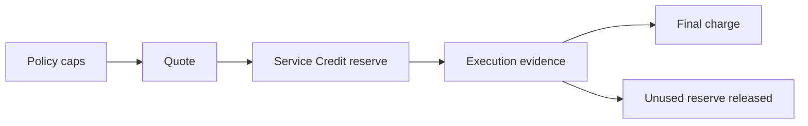

# Quotes, reserves, and final charges

## When you are charged

A job holds Service Credit before it runs and is charged only when it settles.
Five facts decide what you pay:

1. **Reserved before submission.** Liskov reserves Service Credit when it
   commits to launching your job, before the job is sent to the network. The
   reserve is the job's reward cap at the rate locked when the offer was made.
   It is a ceiling, never an estimate and never a cost.
2. **Charged at settlement.** Credit is charged only when the job settles,
   after the evidence of its execution reports is final. If that final evidence
   shows no report was filed, the charge is zero and the whole reserve is
   released. If the evidence is unclear, the reserve stays held and the item is
   under review; Liskov never guesses.
3. **A job that never runs costs nothing.** A job that is sent to the network
   but is never matched to a processor, never starts, or never reports settles
   to a zero charge, and its reserve is released. Liskov bears whatever the
   network kept.
4. **Only the consumed reward is charged.** The charge is the job's reward
   budget minus what the network returned when the job was ended, converted at
   the locked rate and never more than the reserve; the rest is released.
   Liskov absorbs every network transaction fee: no fee to deploy a job, end
   it, or make any other transaction is ever charged to you. Whether the run
   succeeded or failed is not part of the amount. A completed run is typically
   charged a fraction of its reserve.
5. **A pending reserve is a ceiling.** While a job's money is pending, you see
   a reserved amount held against your balance, shown as "up to" that amount.
   Your available credit is your balance minus open reserves. The charge
   appears only at settlement.

## From quote to final charge

Liskov separates estimation, authorization, and settlement so a customer can
review a bounded commitment before work proceeds.



## Read each amount correctly

- A **policy cap** is the maximum authority authored for a job or generation.
- A **quote** is a current estimate based on the proposed work and known market
  facts.
- A **reserve** temporarily reduces available Service Credits so the bounded
  work can settle.
- A **final charge** is the amount actually debited after required evidence.
- A **release** returns unused reserve to available credit.

A reserve is not a charge and not proof of successful execution. A final
charge can be below the cap and quote. A financial item can enter review when
network evidence is incomplete or contradictory; Liskov must not guess.

For managed custody, a finalized scanner can instead prove that the strict
report deadline passed with no execution report. That terminal case is **not
billed**: the final charge is zero, the full linked reserve is released, and
the closeout carries `report_absent_not_billed`. It is closed, not an amount in
review, and needs no customer action. Pending, unavailable, outside-coverage,
conflicting, or failed evidence reads still defer settlement.

## Internal network settlement

The service may pay Acurast reward and native fees in network units, bounded by
the effective policy. That is a Liskov treasury mechanic. Customer records stay
denominated in USD Service Credits and should explain the related Application,
deployment, job, and reason.

Execution evidence determines whether Liskov may settle a managed final charge.
When Liskov submits a deregistration transaction, the amount the deregistration
returned in its finalized chain events (the chain calls this the gross refund)
determines how much of the reserved amount is released at the
settlement's locked rate. The native transaction fee is recorded separately
and is not part of your charge. Wallet balance movement corroborates those
facts; it does not set the returned amount.

An included deregistration that returned zero means the transaction finalized
and returned nothing. That is different from a case where no
deregistration was submitted: there is then no chain coordinate and no returned
amount. Missing chain evidence must not be presented as a zero return.

The managed zero-charge decision is made from report absence, not by erasing
treasury facts. Liskov retains the admitted network budget, the amount the
deregistration returned, processor payout, and deregistration fee for operator
accounting. Those facts do not appear as a customer balance. Self-custody
remains immutable ACU chain accounting and is never reclassified or reversed.

## Verify

To read one Application's charges, open the Application and choose **Spend**.
**Recent charges** lists its latest executions, one row each: **Requested** is
what the execution reserved, **Charged** is its final charge, and **Still
holding** is reserve that has not been released yet. A charge in review reads
*Not billed*, with the status *Under review by Liskov*, and its hold stays under
**Still holding** until it settles. The **Charged** figure above the table is
the Application's final charges over the last 30 days, as Liskov computes them.
**Full ledger →** opens **Ledger** for that Application, which remains the
organization-wide record with each lineage's detail.

Open **Ledger** (from **Billing & funding**) and match the reserve, settlement,
and release rows to the Application UID and deployment. A reserve is a ceiling,
not a cost; open the lineage on a settled `deploy_spend` row to see the
attempts behind it. Or page through read-only transactions:

```bash
proof liskov organization billing transactions ORGANIZATION_ID \
  --limit 25
```

Use `--before EPOCH_MILLISECONDS` for older records. Never infer a final charge
by subtracting two browser-displayed balances; read the authoritative
transaction record.

See [Spend limits](../configure/spend-limits.md) for authored authority and
[Billing, settlement, and retirement](../troubleshooting/billing-retirement.md)
for a long-running reserve or review.
