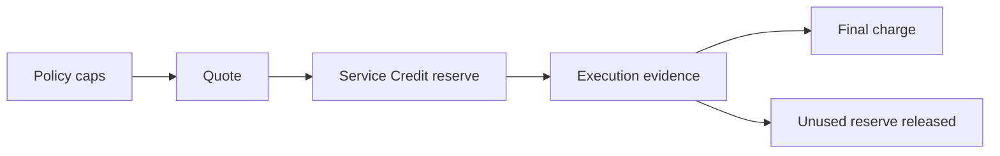

# Quotes, reserves, and final charges

Liskov separates estimation, authorization, and settlement so a customer can
review a bounded commitment before work proceeds.



## Read each amount correctly

- A **policy cap** is the maximum authority authored for a job or generation.
- A **quote** is a current estimate based on the proposed work and known market
  facts.
- A **reserve** temporarily reduces available Service Credits so the bounded
  work can settle.
- A **final charge** is the amount actually debited after required evidence.
- A **release** returns unused reserve to available credit.

A reserve is not a charge and not proof of successful execution. A final
charge can be below the cap and quote. A financial item can enter review when
network evidence is incomplete or contradictory; Liskov must not guess.

For managed custody, a finalized scanner can instead prove that the strict
report deadline passed with no execution report. That terminal case is **not
billed**: the final charge is zero, the full linked reserve is released, and
the closeout carries `report_absent_not_billed`. It is closed, not an amount in
review, and needs no customer action. Pending, unavailable, outside-coverage,
conflicting, or failed evidence reads still defer settlement.

## Internal network settlement

The service may pay Acurast reward and native fees in network units, bounded by
the effective policy. That is a Liskov treasury mechanic. Customer records stay
denominated in USD Service Credits and should explain the related Application,
deployment, job, and reason.

Execution evidence determines whether Liskov may settle a managed final charge.
When Liskov submits a deregistration transaction, the gross refund in its
finalized chain events determines how much of the reserved amount is reclaimed
at the settlement's locked rate. The native transaction fee is recorded
separately. Wallet balance movement corroborates those facts; it does not set
the reclaim amount.

An included deregistration with a gross refund of zero means the transaction
finalized and returned no gross refund. That is different from a case where no
deregistration was submitted: there is then no chain coordinate or refund
amount. Missing chain evidence must not be presented as a zero return.

The managed zero-charge decision is made from report absence, not by erasing
treasury facts. Liskov retains the admitted network budget, gross refund,
processor payout, and deregistration fee for operator accounting. Those facts
do not appear as a customer balance. Self-custody remains immutable ACU chain
accounting and is not reclassified as an ACU refund or reversal.

## Verify

Open **Billing & funding** and match the reserve/final/release records to the
Application UID and deployment. Or page through read-only transactions:

```bash
proof liskov organization billing transactions ORGANIZATION_ID \
  --limit 25
```

Use `--before EPOCH_MILLISECONDS` for older records. Never infer a final charge
by subtracting two browser-displayed balances; read the authoritative
transaction record.

See [Spend limits](../configure/spend-limits.md) for authored authority and
[Billing, settlement, and retirement](../troubleshooting/billing-retirement.md)
for a long-running reserve or review.
